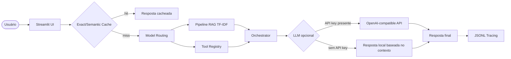

# LGPD Dev Assistant — RAG + Tool-use para decisões de privacidade em software

Assistente de portfólio que ajuda desenvolvedores a consultar rapidamente boas práticas de LGPD, com recuperação de contexto, citação de artigos, avaliação preliminar de risco, cache e model routing.

> Projeto individual — Raylson Silva de Lima  
> Disciplina: Desenvolvendo Software com IA Generativa

---

## 1. Demo

URL pública da demo: `PREENCHER_APOS_DEPLOY_STREAMLIT`  
URL do vídeo demo: `PREENCHER_APOS_GRAVAR_VIDEO`  
URL do repositório: `PREENCHER_APOS_SUBIR_GITHUB`

Sugestão de fluxo para a gravação:

1. Abrir a aplicação Streamlit.
2. Perguntar: `Posso armazenar CPF do cliente para emissão de nota fiscal?`
3. Mostrar as fontes recuperadas, a tool `assess_lgpd_risk` e a rota escolhida.
4. Perguntar: `O que devo fazer se houve vazamento de dados pessoais? Cite o artigo 48.`
5. Repetir a primeira pergunta para demonstrar cache hit.

---

## 2. Problem statement

Times de desenvolvimento frequentemente precisam tomar decisões rápidas sobre coleta, armazenamento, retenção, logs, integrações e incidentes envolvendo dados pessoais. Essas decisões exigem consulta a políticas, princípios e artigos da LGPD, mas a leitura direta da legislação é lenta e sujeita a interpretações incompletas. O objetivo deste projeto é criar um assistente RAG auditável que responda com base em um corpus textual e use tools determinísticas para apoiar a citação de artigos e a avaliação preliminar de risco.

---

## 3. Corpus

O corpus está em `data/corpus/lgpd_corpus_dev.md` e contém 12 seções/páginas sobre LGPD aplicada a desenvolvimento de software:

- conceitos essenciais;
- princípios da LGPD;
- bases legais;
- dados sensíveis;
- direitos do titular;
- registro de operações;
- segurança;
- incidentes;
- retenção;
- compartilhamento com terceiros;
- boas práticas para times de desenvolvimento.

Observação: o corpus é didático e serve para demonstração. Em produção, deve ser substituído ou complementado pelo texto oficial da LGPD, guias da ANPD e políticas internas da organização.

---

## 4. Arquitetura



### Componentes principais

| Componente | Arquivo | Função |
|---|---|---|
| RAG | `src/pipeline/rag.py` | Carrega corpus, divide em chunks, indexa e recupera contexto relevante |
| Tools | `src/pipeline/tools.py` | Implementa `cite_article` e `assess_lgpd_risk` com schemas JSON |
| Cache | `src/pipeline/cache.py` | Cache exato e semântico para reduzir custo e latência |
| Routing | `src/pipeline/routing.py` | Decide rota cheap-first ou premium conforme complexidade |
| Orquestração | `src/pipeline/orchestrator.py` | Une RAG, tools, cache, routing e geração de resposta |
| UI | `src/ui/streamlit_app.py` | Interface pública em Streamlit |
| Observabilidade | `src/observability/trace.py` | Logs estruturados em JSONL |

---

## 5. Setup local

### Usando pip

```bash
python -m venv .venv
source .venv/bin/activate  # Linux/Mac
# .venv\Scripts\activate  # Windows
pip install -r requirements.txt
streamlit run src/ui/streamlit_app.py
```

### Usando uv

```bash
uv venv
uv pip install -r requirements.txt
streamlit run src/ui/streamlit_app.py
```

### Variáveis de ambiente

```bash
cp .env.example .env
```

O projeto funciona sem `OPENAI_API_KEY`, usando fallback local. Para usar LLM real, preencha:

```env
OPENAI_API_KEY=sua_chave_aqui
CHEAP_MODEL=gpt-4o-mini
PREMIUM_MODEL=gpt-4o
```

---

## 6. Tool-use

O projeto possui duas tools reais de domínio:

### `cite_article(article_number)`

Retorna um resumo auditável de artigos LGPD presentes no corpus, como Art. 5º, 6º, 7º, 18, 37, 46 e 48.

### `assess_lgpd_risk(data_type, purpose, is_sensitive, has_consent)`

Avalia risco preliminar do tratamento de dados pessoais, retornando nível de risco, artigos sugeridos e ações recomendadas.

Exemplo de schema:

```json
{
  "type": "function",
  "function": {
    "name": "cite_article",
    "description": "Retorna resumo auditável de um artigo da LGPD disponível no corpus do projeto.",
    "parameters": {
      "type": "object",
      "properties": {
        "article_number": {"type": "integer"}
      },
      "required": ["article_number"]
    }
  }
}
```

---

## 7. Perguntas de teste que se beneficiam de RAG

1. `Posso armazenar CPF do cliente para emissão de nota fiscal?`
2. `O que devo fazer se houve vazamento de dados pessoais? Cite o artigo 48.`
3. `Quais cuidados devo ter ao usar logs com e-mail e IP para detectar fraude?`

Essas perguntas dependem do corpus porque exigem princípios, bases legais, segurança, retenção e incidentes; e também se beneficiam de tool-use porque precisam de citação de artigo e avaliação preliminar de risco.

---

## 8. Custo, cache e routing

Medidas de redução de custo implementadas:

1. **Exact cache:** reaproveita respostas para perguntas repetidas.
2. **Semantic cache:** reaproveita respostas quando a pergunta é semanticamente parecida.
3. **Model routing cheap-first:** perguntas simples usam modelo barato; perguntas complexas usam modelo premium.

Estimativa demonstrativa:

| Estratégia | Custo estimado |
|---|---:|
| Todas as chamadas no modelo premium | 100% |
| Cheap-first + cache | Redução esperada superior a 50% em uso repetido |

Para gerar relatório local:

```bash
python scripts/run_demo.py
```

---

## 9. Métricas observadas na execução local

| Métrica | Valor esperado |
|---|---:|
| Perguntas de teste | 3 |
| Tools customizadas | 2 |
| Fontes recuperadas por pergunta | 4 |
| Cache exact demonstrado | Sim |
| Routing cheap/premium | Sim |
| Execução sem API key | Sim |
| Execução com API key | Opcional |

---

## 10. Design decisions

- Usei **RAG local com TF-IDF** para tornar a demo reprodutível em qualquer ambiente, mesmo sem chave de API.
- Usei **chunks por seção/página**, porque o corpus já está organizado por temas e isso melhora auditabilidade.
- Usei **tool-use determinístico** para citação de artigos e avaliação de risco, evitando que o modelo invente números de artigos.
- Usei **cache exato e semântico** para demonstrar redução de custo e latência.
- Usei **routing cheap-first** para separar perguntas simples de perguntas decisórias mais complexas.

---

## 11. Limitações

- O corpus é didático e não substitui o texto oficial da LGPD, políticas internas, ANPD ou análise jurídica.
- A avaliação de risco é preliminar e baseada em heurísticas simples, não em parecer jurídico.
- O modo fallback local não tem a mesma fluência de um LLM real; para portfólio público, recomenda-se configurar uma API key.

---

## 12. Deploy no Streamlit Cloud

1. Subir este projeto em um repositório público no GitHub.
2. Acessar Streamlit Cloud.
3. Criar app apontando para `src/ui/streamlit_app.py`.
4. Configurar variáveis em `Secrets`, se quiser usar LLM real:

```toml
OPENAI_API_KEY="sua_chave"
CHEAP_MODEL="gpt-4o-mini"
PREMIUM_MODEL="gpt-4o"
```

5. Abrir a URL pública em janela anônima e testar o fluxo principal.

---

## 13. Smoke test

```bash
pytest -q
```

---

## 14. Checklist final

- [x] Corpus textual com mais de 10 seções/páginas.
- [x] Pelo menos 3 perguntas com benefício real de RAG.
- [x] Tool customizada de domínio.
- [x] Cache para redução de custo.
- [x] Routing cheap-first.
- [x] UI em Streamlit.
- [x] README com problema, arquitetura, setup, custo, decisões e limites.
- [x] Testes de smoke.
- [ ] URL pública da demo.
- [ ] URL do repositório.
- [ ] URL do vídeo demo.
